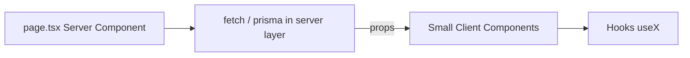

# Codebase cleanup per rules.mdc (revised with Server/Client + function rules)

## New alignment: Server vs Client (rules.mdc 67–90)

These rules sit alongside existing component size limits (100-line components, 200-line files, hooks 100-150 lines), function design constraints, and the **route vs shared UI** boundary.

| Principle                          | What it means for this repo                                                                                                                                                                                       |
| ---------------------------------- | ----------------------------------------------------------------------------------------------------------------------------------------------------------------------------------------------------------------- |
| `**page.tsx` is a Server Component | No `"use client"` on `page.tsx`. Pages orchestrate: fetch/compose on the server, render client children only where needed.                                                                                        |
| **Prefer Server Components**       | Default new UI to Server Components; add `"use client"` only for interactivity (state, effects, handlers).                                                                                                        |
| **Small client islands**           | Do not grow monolithic `*-client.tsx` files. Split into small client components + hooks under `[src/components/](src/components/)` / `[src/hooks/](src/hooks/)`; keep route files as thin composition.            |
| **Data & rendering**               | Fetch in Server Components (`page.tsx` or server layouts) when possible; pass data into client components via **props**. Avoid client-side fetching unless necessary (e.g. live updates, user-triggered refetch). |
| **Goal**                           | Less client JS, more server-rendered content for performance and SEO.                                                                                                                                             |

**Relationship to existing plan items:** Phases B–C (UI splits and app shells) should apply the **size/structure** rules *and* this **server/client data flow**. Phase E (API routes) is unchanged: server-only, no UI.

## New alignment: Function design rules (rules.mdc 107-128, 190-193)

Apply these constraints across hooks, `src/lib`, and route helpers while refactoring:

- Prefer small, single-purpose functions (5-15 lines preferred).
- If a function exceeds ~20 lines or handles multiple concerns, split into helpers immediately.
- Avoid deep nesting (max 2-3 levels); flatten flow with guard clauses.
- If a function name cannot clearly describe one job, it is too broad and should be split.
- Keep heavy transformation/validation/business rules out of UI components and in `src/lib` (or server services if introduced).

---

## Updates to phased execution

### Phase B — Hot-spot UI (unchanged goal, stricter boundary)

When splitting **BoardHeader**, **KanbanBoard**, **IntegrationSettings**, modals:

- Prefer **presentational Server Components** where there is no state/events; wrap only interactive leaves in `"use client"`.
- Keep **React Query / handlers** in hooks; do not use client components as dump-all containers for data fetching if the same data can be loaded in the parent Server Component and passed down.
- While touching hooks/components, split multi-concern handlers into short helpers (function rules), especially event handlers that started growing during extraction.

### Phase C — App router shells (revised)

Applies to `[home/page.tsx](src/app/home/page.tsx)`, `[billing-client.tsx](src/app/(dashboard)`/billing/billing-client.tsx), `[profile-client.tsx](src/app/(dashboard)`/profile/profile-client.tsx), and similar:

- `**page.tsx`: Server Component — load data here (or via server helpers), pass serializable props to client children.
- `***-client.tsx`**: Only interactivity and wiring; **not the primary place for initial data load unless unavoidable.
- Move reusable sections to `[src/components/{domain}/](src/components/)` as today, but split so **large static/marketing blocks** can stay server-rendered when extracted (avoid marking entire sections client by default).

### New emphasis — incremental audit (can merge with Phase C PRs)

- For each touched route: confirm **no accidental `"use client"`** on `page.tsx`; confirm **fetch location** (server first).
- Document exceptions briefly in code only if needed (e.g. real-time-only data), not new markdown docs.

### Phases D–F

- **D (lib splits)**, **E (thin API routes)**, **F (verify build/smoke)** — unchanged; they are server-side by nature.

### New emphasis — function pass (cross-phase)

- During every phase, identify functions >20 lines with mixed concerns and split by concern (validation, transformation, persistence, side effects).
- Prioritize long route handlers and large hook action blocks first; these produce the biggest readability win per rule.

---

## Enforcement table (additions)

| Rule                          | Action                                                                                        |
| ----------------------------- | --------------------------------------------------------------------------------------------- |
| Server default for pages      | `page.tsx` without `"use client"`; data fetch on server where feasible                        |
| Client only for interactivity | State/effects/events in small components or hooks                                             |
| Props down                    | Server parents pass data to client children; avoid redundant client fetch                     |
| Function focus                | Prefer 5-15 line focused functions; split >20-line or mixed-concern functions                 |
| Existing                      | < 100 lines per component, < 200 lines per file, thin routes, components in `src/components/` |

---

## Success criteria (additions)

- Touched `**page.tsx` files remain Server Components unless there is a documented exception.
- Initial **data for a route** is loaded on the server when practical, with client components receiving **props**.
- `***-client.tsx`** files trend toward **composition + interactivity, not bulk data loading and not whole-page client trees.
- Touched hooks/lib/route helpers show progressive reduction of long multi-concern functions (targeting rule-compliant, shallow, composable helpers).
- Existing criteria retained: components < 100 lines, hooks 100–150 lines, thin API routes, reusable UI under `src/components/`.

---

## What not to do (additions)

- Do **not** add `"use client"` to `page.tsx` for convenience.
- Do **not** duplicate server-fetchable data with client-side `useEffect` fetch without a clear reason.
- Do **not** keep utility or route helper functions as long "do everything" blocks when they exceed function thresholds.

---

## Todo mapping (merge with existing cleanup)

| Existing todo              | Revision                                                                                                                   |
| -------------------------- | -------------------------------------------------------------------------------------------------------------------------- |
| `split-app-clients`        | Expand: thin `*-client.tsx` **and** server `page.tsx` fetch + props per rules 67–90                                        |
| `route-vs-shared-boundary` | Keep; add explicit check that **server pages** compose **shared components** without forcing unnecessary client boundaries |
| New (optional standalone)  | **Server/client boundary pass** on dashboard routes touched by Phase C — can be the same PRs as `split-app-clients`        |
| `function-refactor-pass`   | Add explicit pass across touched files for function-size and single-responsibility constraints from rules.mdc              |

Completed items (`rules-audit`, `split-board-header`) stay complete; remaining work (**KanbanBoard**, **IntegrationSettings**, modals, **lib** splits, **app clients**) should apply revised Phase B/C guidance plus the function refactor pass.