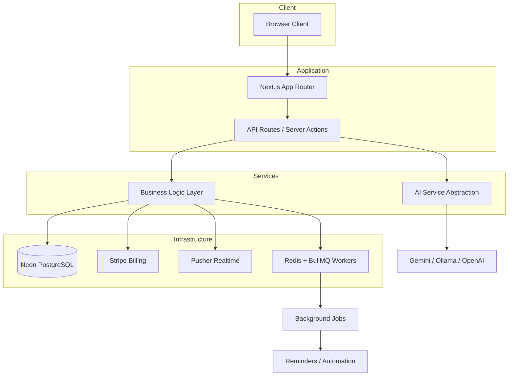
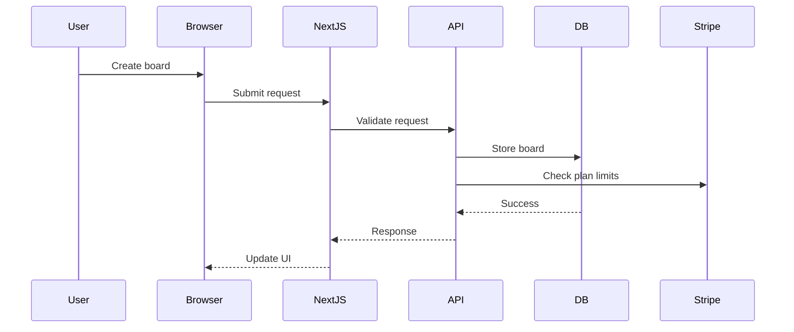

# IntelliTaskPro – AI-Powered Project Management SaaS

A production-ready **multi-tenant project management platform** built with **Next.js, TypeScript, and Neon PostgreSQL**.

The system supports **organization-based tenancy, role-based access control, Stripe subscription billing, AI-powered task generation, and real-time collaboration**.

Designed using modern SaaS architecture patterns including **background workers, usage-based plan enforcement, and scalable API design**.

## Live Application

Production site: https://intellitaskpro.com

IntelliTaskPro is a fully deployed SaaS platform where organizations can manage projects, collaborate in real time, and use AI-assisted planning tools.

Users can create organizations, invite team members, manage boards, and subscribe to paid plans through Stripe.

## Production Features

IntelliTaskPro includes several capabilities typically required for real SaaS applications:

• Multi-tenant organization architecture  
• Stripe subscription billing and customer portal integration  
• Usage-based plan enforcement  
• Role-based access control across organizations and boards  
• Background job processing with Redis and BullMQ  
• Real-time collaboration using Pusher  
• AI-assisted task planning and sprint generation  

## System Architecture



## Request Flow



## Deployment

The application is deployed as a modern SaaS stack:

Frontend / API:
Next.js application deployed on Vercel

Database:
Neon PostgreSQL

Billing:
Stripe subscriptions and webhooks

Background Jobs:
Redis + BullMQ workers

Real-time:
Pusher event channels

## Key SaaS Capabilities

• Multi-tenant organizations with strict data isolation  
• Role-based access control (ADMIN / MEMBER / VIEWER)  
• Board-level permissions for granular collaboration  
• Stripe subscription billing with plan enforcement  
• Usage limits for boards, members, and tasks  
• AI task generation and sprint planning  
• Real-time board collaboration using Pusher  
• Background workers for automation and reminders

## Architecture Goals

This project was designed around several core principles:

• Clear tenant isolation between organizations  
• Server-side data ownership to simplify client logic  
• Relational schema design to enforce domain rules  
• Event-driven workflows for background automation  
• Flexible AI provider abstraction

## Features

- **Kanban Boards**: Drag-and-drop task management with optimistic UI updates
- **AI Task Generation**: Automatically break down projects into tasks using Google Gemini (free tier)
- **AI Sprint Planning**: Intelligent sprint planning based on backlog and capacity
- **Real-time Updates**: Live collaboration using Pusher
- **Multi-tenant Security**: Organization and team isolation with role-based access
- **Board-Level Permissions**: Granular access control per board (Admin/Member/Viewer)
- **SaaS Ready**: Stripe billing, subscription management, usage limits, and plan enforcement
- **Authentication**: NextAuth.js with email/password authentication
- **Background Workers**: Automated reminders, automation rules, and cron jobs

## Tech Stack

Frontend
- Next.js (App Router)
- React
- TypeScript
- Tailwind CSS

Backend
- Node.js
- Prisma ORM
- Neon PostgreSQL

Infrastructure
- Stripe (billing & subscriptions)
- Pusher (real-time updates)
- Redis + BullMQ (background workers)

AI
- Google Gemini
- Ollama (local models)
- OpenAI / Anthropic (optional)

## Database Architecture

The system uses a **multi-tenant relational schema** designed for organization isolation.

Core entities:

User → authentication and user accounts  
Organizations → top-level tenant isolation  
Teams → organizational groups  
Members → user-role relationships within organizations  

Project management:

Boards → project boards  
Tasks → individual work items  
Sprints → time-boxed planning cycles  
Comments → task discussion threads  

SaaS infrastructure:

Subscription → organization billing  
Plan → plan limits and features  
Usage → usage tracking and enforcement

## Getting Started

### Prerequisites

- Node.js 18+ or Bun
- Neon PostgreSQL database
- Stripe account (for billing - test mode works)
- Redis (for workers - optional)
- Google Gemini API key (free tier recommended)
- Pusher account (optional, for realtime)

### Installation

1. Clone the repository
2. Install dependencies:
   ```bash
   bun install
   ```

3. Set up environment variables:
   ```bash
   cp .env.example .env.local
   ```
   
   Fill in your environment variables:
   - `DATABASE_URL`: Your Neon PostgreSQL connection string
   - `NEXTAUTH_SECRET`: Generate with `openssl rand -base64 32`
   - `NEXTAUTH_URL`: Your app URL (e.g., `http://localhost:3000`)
   - **Stripe Configuration**:
     - `STRIPE_SECRET_KEY`: Your Stripe secret key (starts with `sk_test_` for test mode)
     - `STRIPE_WEBHOOK_SECRET`: Webhook signing secret (starts with `whsec_`)
     - `NEXT_PUBLIC_STRIPE_PUBLISHABLE_KEY`: Your Stripe publishable key (starts with `pk_test_`)
   - **Pusher** (optional, for realtime):
     - `PUSHER_APP_ID`, `PUSHER_KEY`, `PUSHER_SECRET`, `PUSHER_CLUSTER`
   - **AI Configuration**:
     - `AI_PROVIDER`: "demo" (free, default), "gemini" (free tier), "ollama" (local), "openai", or "anthropic"
     - `GOOGLE_GEMINI_API_KEY`: Recommended - for Gemini free tier (15 RPM)
     - `OLLAMA_URL`: Optional - for local Ollama (default: http://localhost:11434)
     - `OLLAMA_MODEL`: Optional - Ollama model name (default: llama3)
     - `OPENAI_API_KEY`: Optional - for OpenAI (paid)
     - `ANTHROPIC_API_KEY`: Optional - for Anthropic (paid)
   - `REDIS_URL`: Your Redis connection URL (optional, for workers)

4. Set up the database:
   ```bash
   bun run db:push
   bun run db:generate
   bun run db:seed
   ```

5. Set up Stripe (for billing):
   - Create a Stripe account at https://stripe.com
   - Get your API keys from the Stripe Dashboard
   - Create products and prices for your plans (Pro and Enterprise)
   - Update the `stripePriceId` in your database:
     ```bash
     STRIPE_PRO_PRICE_ID=price_xxx STRIPE_ENTERPRISE_PRICE_ID=price_yyy bun run update-stripe-prices
     ```
   - Set up webhooks (see [Stripe Setup](#stripe-setup) section below)

6. Run the development server:
   ```bash
   bun run dev
   ```

6. (Optional) Run the worker service:
   ```bash
   cd workers
   bun install
   bun run dev
   ```

## Project Structure

```
├── src/
│   ├── app/              # Next.js App Router pages
│   │   ├── (auth)/       # Authentication pages
│   │   ├── (dashboard)/  # Protected dashboard pages
│   │   └── api/          # API routes
│   ├── components/        # React components
│   ├── lib/              # Utility libraries
│   │   ├── prisma.ts     # Prisma client
│   │   ├── auth.ts       # Auth helpers
│   │   └── pusher.ts     # Pusher client
│   ├── hooks/            # React hooks
│   └── types/            # TypeScript types
├── workers/              # Background worker service
└── prisma/
    └── schema.prisma     # Database schema
```

## API Routes

### Authentication
- `POST /api/auth/signup` - Create user account

### Organizations
- `POST /api/organizations` - Create organization
- `GET /api/organizations` - List user's organizations
- `POST /api/organizations/[id]/members` - Add member to organization
- `DELETE /api/organizations/[id]/members/[memberId]` - Remove member

### Boards
- `POST /api/boards` - Create board (requires org membership, checks usage limits)
- `GET /api/boards` - List boards (filtered by board-level access)
- `GET /api/boards/[id]` - Get board details (requires board access)
- `PATCH /api/boards/[id]` - Update board (requires board ADMIN role)
- `DELETE /api/boards/[id]` - Delete board (requires org ADMIN role)
- `POST /api/boards/[id]/members` - Add member to board (requires board ADMIN)
- `GET /api/boards/[id]/members` - List board members (requires board VIEWER)
- `PATCH /api/boards/[id]/members/[memberId]` - Update board member role (requires board ADMIN)
- `DELETE /api/boards/[id]/members/[memberId]` - Remove member from board (requires board ADMIN)

### Tasks
- `POST /api/tasks` - Create task (requires board MEMBER access, checks usage limits)
- `GET /api/tasks` - List tasks
- `PATCH /api/tasks/[id]` - Update task (requires board MEMBER access)
- `DELETE /api/tasks/[id]` - Delete task (requires board MEMBER access)

### Sprints
- `POST /api/sprints` - Create sprint (requires board MEMBER access)
- `GET /api/sprints` - List sprints (requires board access)
- `PATCH /api/sprints/[id]` - Update sprint (requires board MEMBER access)
- `DELETE /api/sprints/[id]` - Delete sprint (requires board MEMBER access)

### AI
- `POST /api/ai/tasks` - Generate tasks with AI (requires plan feature)
- `POST /api/ai/sprint-planning` - AI sprint planning (requires plan feature)

### Billing & Subscriptions
- `GET /api/plans` - List available subscription plans
- `GET /api/subscriptions` - Get organization subscription
- `POST /api/subscriptions` - Create/upgrade subscription (redirects to Stripe checkout for paid plans)
- `PATCH /api/subscriptions` - Manage subscription (sync status, redirect to Stripe customer portal)
- `GET /api/usage` - Get organization usage metrics
- `POST /api/stripe/webhook` - Stripe webhook handler (subscription events)

### Real-time
- `POST /api/pusher/auth` - Pusher authentication

## Authentication & Authorization

The system uses NextAuth.js with Credentials provider:
- Email/password authentication
- JWT-based sessions
- Protected routes via middleware
- **Organization-level roles**: ADMIN, MEMBER, VIEWER (control organization-wide access)
- **Board-level roles**: ADMIN, MEMBER, VIEWER (granular per-board access control)
- Explicit board access required - users must be granted access to each board
- Organization admins can manage board membership, board admins can manage board content

## Real-time Updates

Real-time features use Pusher:
- Task updates broadcast to all connected clients
- Board changes sync in real-time
- Connection state management

Alternative: Use polling by setting `refetchInterval` in React Query.

## Background Workers

The worker service handles:
- **Reminders**: Scheduled task reminders via email
- **Automation**: Rule-based task automation
- **Cron Jobs**: Daily reports, sprint status updates, cleanup tasks

## Development

- Run Prisma Studio: `bun run db:studio`
- Generate Prisma client: `bun run db:generate`
- Run migrations: `bun run db:migrate`

## Stripe Setup

1. **Create Products and Prices**:
   - Go to Stripe Dashboard → Products
   - Create "Pro" product with monthly price ($29.99)
   - Create "Enterprise" product with monthly price ($99.99)
   - Copy the Price IDs (start with `price_`)

2. **Update Database**:
   ```bash
   STRIPE_PRO_PRICE_ID=price_xxx STRIPE_ENTERPRISE_PRICE_ID=price_yyy bun run update-stripe-prices
   ```

3. **Set Up Webhooks**:
   - Go to Stripe Dashboard → Developers → Webhooks
   - Add endpoint: `https://your-domain.com/api/stripe/webhook`
   - Select events:
     - `customer.subscription.created`
     - `customer.subscription.updated`
     - `customer.subscription.deleted`
     - `checkout.session.completed`
     - `invoice.payment_succeeded`
     - `invoice.payment_failed`
   - Copy the webhook signing secret to `STRIPE_WEBHOOK_SECRET`

4. **For Local Development**:
   ```bash
   stripe listen --forward-to localhost:3000/api/stripe/webhook
   ```
   Copy the webhook signing secret from the output to your `.env.local`

## Subscription Plans

The system includes three default plans:

- **Free**: $0/month
  - 3 boards, 5 members, 50 tasks
  - Real-time updates
  - No AI features

- **Pro**: $29.99/month
  - 20 boards, 25 members, 1,000 tasks
  - AI task generation
  - AI sprint planning
  - Basic automation
  - Advanced reports

- **Enterprise**: $99.99/month
  - Unlimited boards, members, and tasks
  - All Pro features
  - Advanced automation
  - Custom integrations
  - Priority support

Usage limits are automatically enforced when creating boards, members, or tasks.

## Deployment

1. Deploy Next.js app to Vercel or similar
2. Set up Stripe webhook endpoint in production
3. Configure all environment variables in deployment platform
4. Run database migrations: `bun run db:push`
5. Seed default plans: `bun run db:seed`
6. Update Stripe price IDs: `bun run update-stripe-prices`
7. (Optional) Deploy worker service separately (e.g., Railway, Render)
8. (Optional) Set up Redis instance (e.g., Upstash, Redis Cloud)

## Migration from Supabase

This project was migrated from Supabase to Neon. Key changes:
- Database: Supabase PostgreSQL → Neon PostgreSQL
- Auth: Supabase Auth → NextAuth.js
- Realtime: Supabase Realtime → Pusher
- Storage: Removed (not implemented)

## AI Configuration (Free Options for Portfolio)

The system supports multiple AI providers, with **free options perfect for portfolio projects**:

### 1. Google Gemini (Default - Free Tier) ⭐ Recommended
- **Cost**: Free (15 requests/minute), then $0.075 per 1M tokens
- **Setup**: Get free API key from [Google AI Studio](https://makersuite.google.com/app/apikey)
- **Best for**: Real AI with generous free tier - perfect for portfolio projects
- **Usage**: Set `AI_PROVIDER=gemini` (default) and `GOOGLE_GEMINI_API_KEY=your-key`
- **Note**: Uses `gemini-1.5-flash` model for fast, cost-effective responses

### 2. Demo Mode (Fallback - Completely Free)
- **Cost**: $0
- **Setup**: No API keys needed
- **How it works**: Rule-based task generation that simulates AI
- **Best for**: Portfolio demos when API keys aren't available
- **Usage**: Set `AI_PROVIDER=demo` (automatic fallback if Gemini fails)

### 3. Ollama (Local - Completely Free)
- **Cost**: $0 (runs on your machine)
- **Setup**: 
  ```bash
  # Install Ollama
  curl -fsSL https://ollama.ai/install.sh | sh
  
  # Pull a model (e.g., Llama 3)
  ollama pull llama3
  ```
- **Best for**: Full control, no API limits, completely free
- **Usage**: Set `AI_PROVIDER=ollama` and optionally `OLLAMA_URL` and `OLLAMA_MODEL`

### 4. Paid Options (Optional)
- **OpenAI**: GPT-3.5 Turbo (~$2 per 1000 generations)
- **Anthropic**: Claude Haiku (~$1.50 per 1000 generations)

### Recommendation for Portfolio
Use **Google Gemini** - it's free (15 requests/minute), provides real AI capabilities, and demonstrates the feature perfectly. Just get a free API key from [Google AI Studio](https://makersuite.google.com/app/apikey) and set `GOOGLE_GEMINI_API_KEY` in your `.env.local`.

The system automatically falls back to demo mode if Gemini is unavailable, so it always works!

## Architecture Decisions

Key system design decisions are documented using Architecture Decision Records (ADR).

See:

docs/architecture/

## License

MIT
